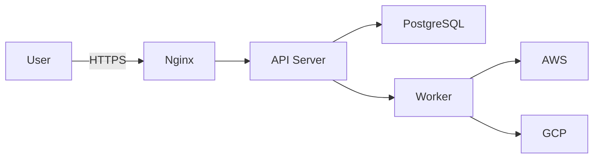

# Visual Assets Guide for OCPCTL Presentations

This guide provides recommendations for artwork, diagrams, and visual elements to enhance your OCPCTL presentations.

## Table of Contents
- [Color Palette](#color-palette)
- [Recommended Diagrams](#recommended-diagrams)
- [Tools for Creating Visuals](#tools-for-creating-visuals)
- [Slide-Specific Recommendations](#slide-specific-recommendations)
- [Icon Resources](#icon-resources)
- [Stock Photos & Illustrations](#stock-photos--illustrations)
- [Animation Suggestions](#animation-suggestions)

---

## Color Palette

### Primary Colors (Recommended)

```
OCPCTL Brand Colors (Suggested):
- Primary Blue:    #0066CC  (Trust, Technology)
- Success Green:   #28A745  (Success, Savings)
- Warning Orange:  #FD7E14  (Attention, Alerts)
- Danger Red:      #DC3545  (Failures, Urgent)
- Dark Gray:       #343A40  (Text, Professional)
- Light Gray:      #F8F9FA  (Backgrounds)
```

### Cloud Provider Colors

```
AWS:        #FF9900  (Orange)
GCP:        #4285F4  (Blue)
IBM Cloud:  #0F62FE  (Blue)
Azure:      #0078D4  (Blue)
OpenShift:  #EE0000  (Red)
Kubernetes: #326CE5  (Blue)
```

### Cost Visualization

```
High Cost:     #DC3545  (Red)
Medium Cost:   #FD7E14  (Orange)
Low Cost:      #28A745  (Green)
Savings:       #20C997  (Teal)
```

---

## Recommended Diagrams

### 1. Architecture Overview (Slide 13)

**Diagram Type:** System Architecture Diagram

**Recommended Tool:** Excalidraw, Lucidchart, or draw.io

**Elements to Include:**
```
┌─────────────────────────────────────────┐
│  Users (Browser/CLI/API)                │
└────────────┬────────────────────────────┘
             │ HTTPS
             ▼
┌─────────────────────────────────────────┐
│  Nginx Reverse Proxy                    │
│  (TLS Termination, Rate Limiting)       │
└────┬──────────────┬─────────────────────┘
     │              │
     │ /            │ /api/v1/
     ▼              ▼
┌─────────┐    ┌─────────────┐
│ Web UI  │    │ API Server  │
│Next.js  │    │ Go:8080     │
│Port:3000│    │ JWT Auth    │
└─────────┘    └──────┬──────┘
                      │
                      ▼
               ┌──────────────┐
               │ PostgreSQL   │
               │ Database     │
               │ (Clusters,   │
               │  Jobs, Audit)│
               └──────┬───────┘
                      │
                      ▼
               ┌──────────────┐
               │ Worker Pool  │
               │ Go:8081      │
               │ Auto-scaling │
               │ (1-5 workers)│
               └──────┬───────┘
                      │
         ┌────────────┼────────────┐
         ▼            ▼            ▼
     ┌─────┐      ┌─────┐      ┌──────┐
     │ AWS │      │ GCP │      │ IBM  │
     └─────┘      └─────┘      └──────┘
```

**Style:** Clean, professional, use icons for components
**Colors:** Blue for OCPCTL components, provider colors for clouds

---

### 2. Cluster Lifecycle States (Slide 14)

**Diagram Type:** State Machine / Flow Diagram

**Visual Style:** Circular flow with arrows

```
         ┌─────────┐
         │ PENDING │
         └────┬────┘
              │
              ▼
         ┌──────────┐
    ┌───│ CREATING │
    │   └────┬─────┘
    │        │
    │        ▼
    │   ┌────────┐      ┌─────────────┐
    │   │ READY  │─────▶│ HIBERNATING │
    │   └───┬────┘      └──────┬──────┘
    │       │                  │
    │       │                  ▼
    │       │           ┌────────────┐
    │       │           │ HIBERNATED │
    │       │           └──────┬─────┘
    │       │                  │
    │       │                  ▼
    │       │           ┌───────────┐
    │       │           │ RESUMING  │
    │       │           └──────┬────┘
    │       │                  │
    │       │◀─────────────────┘
    │       │
    │       ▼
    │  ┌────────────┐
    │  │ DESTROYING │
    │  └─────┬──────┘
    │        │
    │        ▼
    │  ┌───────────┐
    │  │ DESTROYED │
    │  └───────────┘
    │
    ▼
┌────────┐
│ FAILED │
└────────┘
```

**Colors:**
- Green: READY, DESTROYED
- Yellow: PENDING, CREATING, HIBERNATING, RESUMING, DESTROYING
- Gray: HIBERNATED
- Red: FAILED

**Recommendation:** Animate transitions when presenting

---

### 3. Cost Comparison Chart (Slide 6, Executive Brief)

**Diagram Type:** Bar Chart with Savings Callout

**Tool:** Excel, Google Sheets, Chart.js, or Canva

**Data Visualization:**
```
Monthly Cost ($)
│
│  $829 ▓▓▓▓▓▓▓▓▓▓▓▓▓▓▓▓▓▓▓▓
│       ▓▓▓▓▓▓▓▓▓▓▓▓▓▓▓▓▓▓▓▓
│       ▓▓▓▓▓▓▓▓▓▓▓▓▓▓▓▓▓▓▓▓
│       ▓▓▓▓▓▓▓▓▓▓▓▓▓▓▓▓▓▓▓▓
│  $497 ▓▓▓▓▓▓▓▓▓▓▓▓
│       ▓▓▓▓▓▓▓▓▓▓▓▓
│       ▓▓▓▓▓▓▓▓▓▓▓▓
│  $331 ▓▓▓▓▓▓▓▓  ← 60% Savings!
│       ▓▓▓▓▓▓▓▓
│   $62 ▓▓
│       ▓▓
└──────┴──────────┴──────────┴──────────
     Manual  Manual   OCPCTL   OCPCTL
     24/7    Work-Hrs  Auto-   72hr TTL
                       Hibern.
```

**Style:** Use gradient fills, add savings percentage callouts

---

### 4. Before/After Comparison (Slide 2/3)

**Diagram Type:** Split-Screen Comparison

**Visual Layout:**
```
┌─────────────────────────────────────────────┐
│           BEFORE OCPCTL                     │
├─────────────────────────────────────────────┤
│  ❌ Engineer                                │
│      ↓ Waits hours/days                    │
│  ❌ DevOps Team                             │
│      ↓ Manual provisioning (2-3 hrs)       │
│  ❌ Inconsistent configs                    │
│  ❌ Forgotten clusters ($$$)                │
│  ❌ No visibility                           │
│                                             │
│  Cost: $21K/month wasted                   │
│  Time: 900 DevOps hrs/quarter              │
└─────────────────────────────────────────────┘

┌─────────────────────────────────────────────┐
│           AFTER OCPCTL                      │
├─────────────────────────────────────────────┤
│  ✅ Engineer                                │
│      ↓ Self-service (3 clicks)             │
│  ✅ Automated Platform                      │
│      ↓ Consistent deployment (45 min)      │
│  ✅ Standardized profiles                   │
│  ✅ Auto-cleanup (72hr TTL)                 │
│  ✅ Complete visibility                     │
│                                             │
│  Savings: $18K/month                       │
│  Time: 3,600 hrs/year saved                │
└─────────────────────────────────────────────┘
```

**Colors:** Red/X for before, Green/✓ for after

---

### 5. Multi-Cloud Deployment Diagram (Slide 8)

**Diagram Type:** Cloud Network Diagram

```
        ┌─────────────────┐
        │  OCPCTL Portal  │
        │  (Single UI)    │
        └────────┬────────┘
                 │
        ┌────────┴────────┐
        │   Unified API   │
        └────────┬────────┘
                 │
   ┌─────────────┼─────────────┐
   │             │             │
   ▼             ▼             ▼
┌──────┐    ┌──────┐     ┌──────────┐
│ AWS  │    │ GCP  │     │IBM Cloud │
│      │    │      │     │          │
│ ☁️   │    │ ☁️   │     │    ☁️    │
│      │    │      │     │          │
│OpenShift   │OpenShift  │   IKS    │
│ EKS  │    │ GKE  │     │          │
│ROSA* │    │      │     │          │
└──────┘    └──────┘     └──────────┘
```

**Icons:** Use official cloud provider logos
**Style:** Flat design, modern icons

---

### 6. Cost Savings Timeline (Slide 11, Executive Brief)

**Diagram Type:** Line Graph + Cumulative Savings

```
Cumulative Savings ($K)
│
│ 250─                            ●
│                             ●
│ 200─                     ●
│                      ●
│ 150─              ●
│              ●
│ 100─      ●
│       ●
│  50─●
│
└───┴───┴───┴───┴───┴───┴───┴───
   M1  M2  M3  M4  M5  M6  M7  M8

Total Saved: $244,800/year
Platform Cost: $7,800/year
Net Benefit: $237,000/year
ROI: 30x
```

**Style:** Upward trending line, positive colors (green/blue)

---

### 7. User Journey Flow (Slide 27)

**Diagram Type:** User Flow / Customer Journey

```
┌────────────┐
│  Engineer  │
│  Needs     │
│  Cluster   │
└─────┬──────┘
      │
      ▼
┌──────────────────┐
│ 1. Login to UI   │
│ (3 seconds)      │
└─────┬────────────┘
      │
      ▼
┌──────────────────┐
│ 2. Select        │
│    Profile       │
│ (30 seconds)     │
└─────┬────────────┘
      │
      ▼
┌──────────────────┐
│ 3. Configure     │
│    Name, Version │
│ (1 minute)       │
└─────┬────────────┘
      │
      ▼
┌──────────────────┐
│ 4. Click Create  │
│ (1 second)       │
└─────┬────────────┘
      │
      ▼ [Wait 45 min]
┌──────────────────┐
│ 5. Download      │
│    Kubeconfig    │
│ (10 seconds)     │
└─────┬────────────┘
      │
      ▼
┌──────────────────┐
│ ✅ Working        │
│    Cluster!      │
└──────────────────┘

Total Time: 2 minutes (user effort)
            45 minutes (automated)
```

**Style:** Use person icon at top, clock icons for timing

---

### 8. ROI Visualization (Executive Brief Slide 11)

**Diagram Type:** Stacked Bar or Waterfall Chart

```
Annual Value ($K)
│
│ 250─  ┌──────────┐
│       │          │
│ 200─  │  Total   │
│       │  Value   │
│       │ $244.8K  │
│ 150─  │          │
│       ├──────────┤  ← Orphaned Resources ($28.8K)
│       │          │
│ 100─  │          │  ← Time Saved Value ($120K)
│       │          │
│  50─  │          │  ← Direct Cost Savings ($96K)
│       │          │
│   0─  └──────────┘
│          vs.
│      ┌───┐
│  10─ │$8K│  ← Platform Cost
│      └───┘
│
└──────────────────
     Value  Cost

Net Benefit: $237K
ROI: 30x
```

**Colors:** Stacked green bars for value, small red bar for cost

---

### 9. Team Adoption Curve (Slide 11, Tech Overview)

**Diagram Type:** Growth Chart

```
Active Users
│
│ 40─                         ●
│                         ●
│ 30─                 ●
│             ●   ●
│ 20─     ●
│     ●
│ 10─●
│
└───┴───┴───┴───┴───┴───
   Nov Dec Jan Feb Mar Apr May

Growth: 540% in 6 months
Target: 50 users by Aug
```

**Style:** Smooth curve, future projections dotted line

---

### 10. Security Layers Diagram (Slide 45)

**Diagram Type:** Concentric Circles / Security Onion

```
        ┌─────────────────────────────┐
        │   Physical Security         │
        │  (AWS/GCP Data Centers)     │
        │  ┌───────────────────────┐  │
        │  │  Network Security     │  │
        │  │  (VPC, Private Subs)  │  │
        │  │ ┌──────────────────┐  │  │
        │  │ │ Access Control   │  │  │
        │  │ │ (IAM, RBAC, JWT) │  │  │
        │  │ │ ┌─────────────┐  │  │  │
        │  │ │ │ Data Encrypt│  │  │  │
        │  │ │ │ (TLS, S3,   │  │  │  │
        │  │ │ │  Secrets)   │  │  │  │
        │  │ │ │ ┌────────┐  │  │  │  │
        │  │ │ │ │ Audit  │  │  │  │  │
        │  │ │ │ │  Logs  │  │  │  │  │
        │  │ │ │ └────────┘  │  │  │  │
        │  │ │ └─────────────┘  │  │  │
        │  │ └──────────────────┘  │  │
        │  └───────────────────────┘  │
        └─────────────────────────────┘
```

**Colors:** Dark to light layers, center highlighted

---

## Tools for Creating Visuals

### Diagramming Tools

**1. Excalidraw** (Recommended for hand-drawn style)
- URL: https://excalidraw.com
- Style: Sketch-like, friendly
- Best for: Architecture diagrams, flows
- Export: PNG, SVG
- Cost: Free

**2. Lucidchart** (Professional diagrams)
- URL: https://www.lucidchart.com
- Style: Professional, clean
- Best for: Complex architectures, org charts
- Export: PNG, PDF, SVG
- Cost: Free tier available

**3. Draw.io / diagrams.net** (Free, powerful)
- URL: https://app.diagrams.net
- Style: Professional, customizable
- Best for: All diagram types
- Export: PNG, PDF, SVG, XML
- Cost: Free

**4. Mermaid** (Code-to-diagram)
- Markdown integration
- Version controlled
- Best for: Flowcharts, sequence diagrams
- Cost: Free

Example Mermaid diagram:


**5. Figma** (Design tool)
- URL: https://www.figma.com
- Style: Professional, pixel-perfect
- Best for: UI mockups, detailed designs
- Export: PNG, PDF, SVG
- Cost: Free tier available

---

### Chart & Graph Tools

**1. Chart.js** (Web-based)
- JavaScript charting
- Interactive charts
- Best for: Live data visualization

**2. Plotly** (Advanced charts)
- Python/JavaScript
- Publication-quality
- Best for: Data-heavy slides

**3. Google Sheets** (Simple & effective)
- Built-in charting
- Easy to update
- Best for: Quick charts

**4. Excel / PowerPoint** (Native charts)
- Familiar interface
- Best for: Corporate presentations

---

## Slide-Specific Recommendations

### Slide 1: Title Slide
**Visual:** Hero image or abstract background
- **Recommendation:** Cloud infrastructure abstract (servers, networks)
- **Source:** Unsplash keywords: "data center", "cloud computing", "servers"
- **Style:** Dark blue gradient with subtle tech pattern
- **Text:** White text, bold typography

### Slide 2-3: Problem/Solution
**Visual:** Before/After split screen
- **Left:** Chaotic, manual process (stick figures, crossed out)
- **Right:** Streamlined, automated (checkmarks, clean flow)
- **Colors:** Red/gray on left, green/blue on right

### Slide 8: Supported Platforms
**Visual:** Cloud provider logos arranged cleanly
- **Use official logos:**
  - AWS: Download from AWS branding guidelines
  - GCP: Google Cloud brand assets
  - IBM Cloud: IBM design kit
  - Azure: Microsoft brand center
- **Layout:** Grid or horizontal row
- **Background:** White or light gray

### Slide 13: Architecture
**Visual:** System architecture diagram (see detailed recommendation above)
- **Tool:** Excalidraw or Draw.io
- **Style:** Clean boxes with icons
- **Arrows:** Show data flow direction
- **Labels:** Component names and port numbers

### Slide 20: Cost Tracking
**Visual:** Dashboard mockup or screenshot
- **Option A:** Actual screenshot from OCPCTL dashboard
- **Option B:** Mockup showing key metrics
- **Include:**
  - Cost gauges
  - Trend lines
  - Top spenders table

### Slide 22: Success Story
**Visual:** Metrics in large numbers with icons
```
┌─────────────────┐  ┌─────────────────┐
│   ⏱️ 160 hrs     │  │   💰 $1,800     │
│   Saved/Month   │  │   Saved/Month   │
└─────────────────┘  └─────────────────┘
┌─────────────────┐  ┌─────────────────┐
│   ⭐ 9.5/10      │  │   ✅ 100%       │
│   NPS Score     │  │   Adoption      │
└─────────────────┘  └─────────────────┘
```

### Slide 40: Live Demo
**Visual:** Screenshot or screen recording
- **Option A:** Static screenshot with annotations
- **Option B:** GIF showing cluster creation flow
- **Callouts:** Arrow annotations pointing to key UI elements

### Appendix: Database Schema
**Visual:** Entity Relationship Diagram (ERD)
- **Tool:** dbdiagram.io or Draw.io
- **Show:** Primary tables and relationships
- **Highlight:** Key foreign keys and indexes

---

## Icon Resources

### Free Icon Libraries

**1. Font Awesome**
- URL: https://fontawesome.com
- Style: Simple, professional
- Categories: Cloud, database, security, users
- Format: SVG, web font

**2. Heroicons**
- URL: https://heroicons.com
- Style: Modern, minimalist
- Format: SVG

**3. Feather Icons**
- URL: https://feathericons.com
- Style: Clean, consistent
- Format: SVG

**4. Material Icons**
- URL: https://fonts.google.com/icons
- Style: Google Material Design
- Format: SVG, web font

### Recommended Icons for OCPCTL Slides

```
Concepts:
- Cluster:      🏢 (building) or ☁️ (cloud)
- User:         👤 (person) or 👥 (people)
- Cost:         💰 (money bag) or 💵 (dollar)
- Time:         ⏱️ (stopwatch) or 🕐 (clock)
- Success:      ✅ (checkmark) or 🎯 (target)
- Failure:      ❌ (x-mark) or ⚠️ (warning)
- Security:     🔒 (lock) or 🛡️ (shield)
- Automation:   ⚙️ (gear) or 🤖 (robot)
- Database:     💾 (floppy disk) or 🗄️ (filing cabinet)
- API:          🔌 (plug) or 🔗 (link)
- Monitoring:   📊 (bar chart) or 📈 (trending up)
```

---

## Stock Photos & Illustrations

### Photo Resources (Free)

**1. Unsplash**
- URL: https://unsplash.com
- Keywords for OCPCTL:
  - "data center"
  - "server room"
  - "cloud computing"
  - "team collaboration"
  - "dashboard"

**2. Pexels**
- URL: https://www.pexels.com
- Similar keywords to Unsplash
- Video clips available

**3. Pixabay**
- URL: https://pixabay.com
- Good for illustrations

### Illustration Resources (Free)

**1. unDraw**
- URL: https://undraw.co
- Style: Flat, customizable colors
- Perfect for: Concept illustrations
- Keywords: "developer", "server", "analytics"

**2. Storyset**
- URL: https://storyset.com
- Style: Animated, modern
- Categories: Technology, business
- Format: SVG, animated GIF

**3. Humaaans**
- URL: https://www.humaaans.com
- Style: Diverse, customizable people
- Perfect for: User personas, team illustrations

---

## Animation Suggestions

### Recommended Animations (for digital presentation)

**Slide 13: Architecture**
- **Animation:** Components fade in sequentially (top to bottom)
- **Duration:** 0.5s per component
- **Effect:** Build audience understanding step-by-step

**Slide 14: Cluster Lifecycle**
- **Animation:** Highlight each state as you discuss it
- **Duration:** 1s per state
- **Effect:** Follow the flow path with animation

**Slide 6/22: Cost Comparison**
- **Animation:** Bars grow from bottom to top
- **Duration:** 1s per bar
- **Effect:** Emphasize cost differences

**Slide 11: Metrics Dashboard**
- **Animation:** Numbers count up from 0 to final value
- **Duration:** 2s
- **Effect:** Dramatic reveal of impressive numbers

### Animation Tools

**For PowerPoint:**
- Use built-in Morph transition
- Fade/Wipe animations
- Appear/Grow effects

**For Google Slides:**
- Fade in/out
- Fly in from direction
- Zoom effects

**For Web (HTML export):**
- reveal.js built-in animations
- CSS animations
- JavaScript libraries (anime.js, GSAP)

### When NOT to Animate

❌ **Avoid animations for:**
- Text-heavy slides (hard to read)
- Technical diagrams (distracting)
- Executive presentations (keep it professional)
- Printed handouts (won't work)

✅ **Use animations for:**
- Live presentations
- Process flows
- Revealing data progressively
- Emphasizing key metrics

---

## Brand Guidelines

### Typography

**Recommended Fonts:**

**For Headings:**
- Inter (modern, clean)
- Montserrat (professional)
- Roboto (neutral, readable)

**For Body:**
- Inter
- Open Sans
- Source Sans Pro

**For Code:**
- Fira Code
- JetBrains Mono
- Source Code Pro

### Layout Guidelines

**White Space:**
- Minimum 10% margins on all slides
- Don't cram too much content
- Let visuals breathe

**Consistency:**
- Use same icon style throughout
- Consistent color palette
- Same font sizes for similar elements

**Alignment:**
- Left-align text for readability
- Center images and diagrams
- Consistent spacing between elements

---

## Quick Reference: Slide Enhancement Checklist

Before finalizing your presentation, check:

- [ ] Title slide has compelling visual
- [ ] Consistent color palette throughout
- [ ] All diagrams use same visual style
- [ ] Icons are consistent (same library/style)
- [ ] Charts have clear labels and legends
- [ ] Screenshots are high resolution (300 DPI minimum)
- [ ] Animations are subtle and purposeful
- [ ] Cloud provider logos are official/approved
- [ ] White space is used effectively
- [ ] Text is readable (min 24pt font)
- [ ] High contrast for projector visibility
- [ ] No more than 6 bullet points per slide
- [ ] Key metrics are visually emphasized
- [ ] Flow diagrams have clear directional arrows
- [ ] Success stories have visual metrics

---

## Platform-Specific Export Tips

### For PDF Export (Handouts)

```bash
# High-quality PDF with embedded fonts
marp slides.md --pdf --allow-local-files \
  --pdf-outlines --pdf-notes
```

**Best Practices:**
- 300 DPI for printed handouts
- Embed all fonts
- Test print in grayscale
- Include slide notes

### For PowerPoint (Editable)

```bash
# Export to PPTX for further editing
marp slides.md --pptx --allow-local-files
```

**After export:**
- Apply corporate template
- Add company logo to master slide
- Adjust animations in PowerPoint
- Add speaker notes

### For Web (Interactive)

```bash
# Export to HTML with controls
marp slides.md --html --allow-local-files \
  --bespoke.progress
```

**Features to enable:**
- Progress bar
- Slide numbers
- Navigation controls
- Presenter notes view

---

## Resources

### Design Inspiration

- **Slidesgo** - https://slidesgo.com (free templates)
- **Canva** - https://www.canva.com (templates and editor)
- **Pitch** - https://pitch.com (modern presentation tool)

### Learning Resources

- **Presentation Zen** (book) - Garr Reynolds
- **Slide:ology** (book) - Nancy Duarte
- **Better Presentations** (online course) - Jonathan Lippincott

### Tools Comparison

| Tool | Best For | Cost | Learning Curve |
|------|----------|------|----------------|
| Excalidraw | Quick sketches | Free | Low |
| Lucidchart | Professional diagrams | $$ | Medium |
| Figma | Pixel-perfect design | Free tier | Medium |
| Mermaid | Version-controlled | Free | Low |
| PowerPoint | Corporate standard | $ | Low |

---

## Need Help?

For custom visual design assistance:
- **Internal Design Team** - design-team@example.com
- **Community Resources** - #ocpctl-support on Slack
- **Professional Services** - Consider hiring a presentation designer for high-stakes executive presentations

**Recommended Budget for Professional Design:**
- Simple diagrams: $50-100 per diagram
- Full deck design: $500-1500
- Custom illustrations: $100-300 each
- Animation/video: $1000-3000

---

## Final Tips

### Do's ✅
- Use consistent visual language
- Prioritize clarity over complexity
- Test visuals on projector before presenting
- Use high-contrast colors
- Cite data sources
- Save source files (PSD, Sketch, Figma)

### Don'ts ❌
- Don't use clipart (looks unprofessional)
- Don't use too many different fonts
- Don't animate everything
- Don't use low-resolution images
- Don't violate brand guidelines
- Don't use unlicensed images

**Remember:** The best presentation has visuals that support your message, not distract from it. When in doubt, keep it simple and professional.
